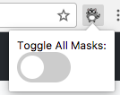

# Azure Mask
This is a browser extension that will mask GUIDs (such as Subscription IDs), email addresses, keys, and connection strings with a blur. The intention of the extension is to make it easier to do screen recordings without revealing sensitive, personal, account information that may show up on screen. It will only run and apply against Azure portal URLs. It's available in Chrome and Firefox.

## Features

* Blurs GUIDs (such as Subscription IDs)
* Blurs your account email
* Hides the "Report a Bug" button (if found)
* Toggle the mask on/off and store this state
* Apply the mask (if enabled) after Document Object Model (DOM) mutations

## Install the Extension

#### From Chrome Web Store

1. In Chrome goto [Chrome Web Store](https://chrome.google.com/webstore/search/azure%20mask)
2. Click on Azure Mask extension
3. Click on Add To Chrome
4. Confirm any prompts

#### From Package

1. `git clone git@github.com:clarkio/azure-mask.git`
2. In Chrome go to [chrome://extensions](chrome://extensions)
3. Check the "Developer mode" option in the top-right corner
4. Find the version you want of the packaged extension in the folder `/azure-mask/extension` found within the repository 
5. Drag the `azure-mask.crx` file to your Chrome window that has the extensions view open
6. Confirm any prompts

#### From Source

1. `git clone git@github.com:clarkio/azure-mask.git`
2. In Chrome go to [chrome://extensions](chrome://extensions)
3. Check the "Developer mode" option in the top-right corner
4. Click the "Load unpacked extension" button
5. Navigate to where you cloned this repo and then choose `/azure-mask/src`

After following these steps you should now see the new extension icon in Chrome.
